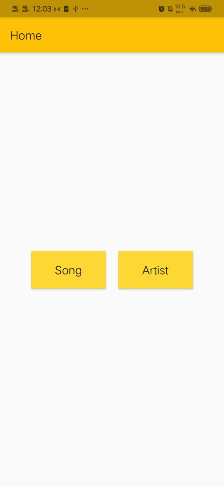
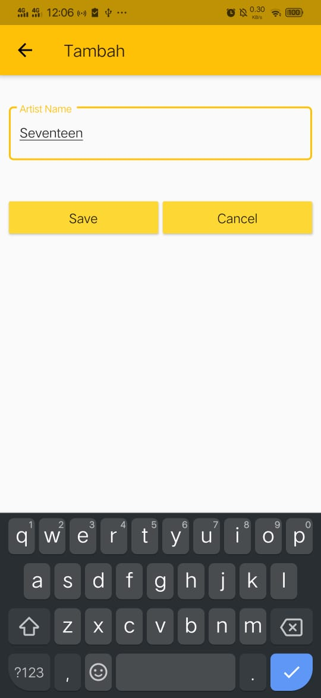
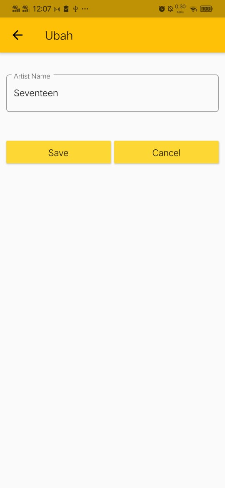
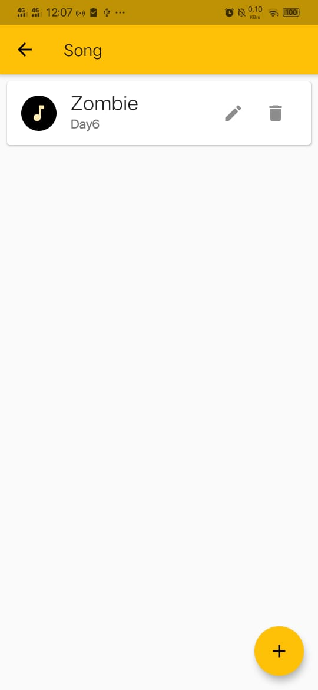
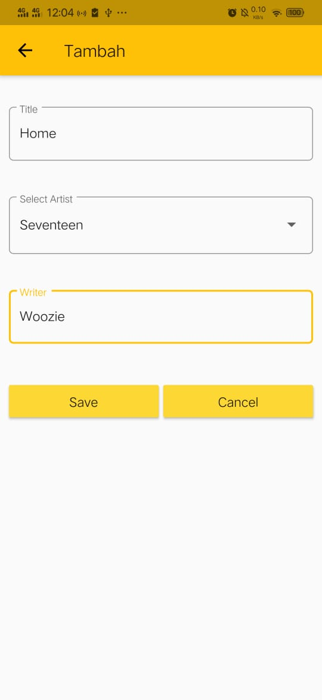
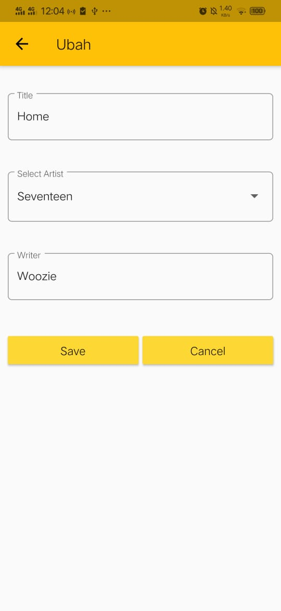
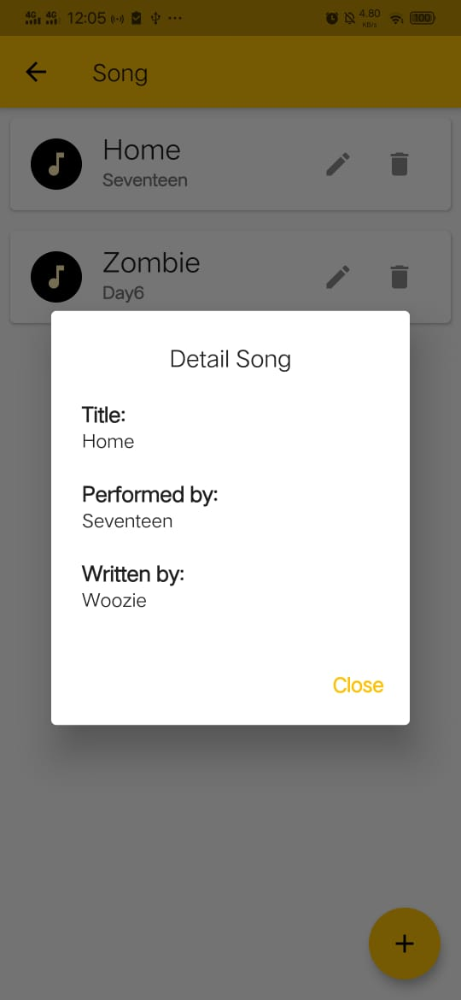

# UTS - Daftar Lagu

## Halaman Home

Pada halaman home terdapat 2 button artist dan button song

## Halaman Artist

Pada halaman artist ini untuk menampilkan data artist yang telah ditambahkan. Pada halaman ini juga dapat melakukan penghapusan data, yaitu dengan mengklik icon tempat sampah.

Untuk menambahkan data artist, klik button add pada pojok kanan bawah. Kemudian untuk menyimpan data yang telah ditambahkan kilk save.

Untuk mengedit data artist, kilk icon pensil.

## Halaman Song

Pada halaman song ini untuk menampilkan data lagu yang telah ditambahkan. Pada halaman ini juga dapat melakukan penghapusan data, yaitu dengan mengklik icon tempat sampah.

Untuk menambahkan data song, klik button add pada pojok kanan bawah. Kemudian untuk menyimpan data yang telah ditambahkan kilk save.

Untuk mengedit data song, kilk icon pensil.

Untuk melihat detail lagu, klik pada lagu yang ingin dilihat. Maka akan muncul pop up yang berisikan detail lagu

